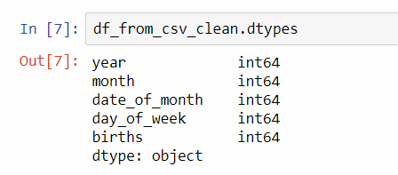

# ETL-Project

### Eric Staveley & Trevor Kulbeth

## Project Proposal

Our project will look at the most popular baby names and birthdays for people within the united state for the years between 1994 and 2003. We will gather data looking at the number of children born in each year, by month, day of month, and day of week.  Additionally we will gather information on what boy and girls name were most popular during each year. We will prepare this data for future analysis using ETL methods. 

## Extract

For this project we will use datasets from the kaggle.com website. Our source for birth dates will come from the Births in U.S. 1994 to 2003 dataset here https://www.kaggle.com/adnanr94/births-in-us-1994-to-2003. The dataset for most popular names will come from the US Baby Names dataset here https://www.kaggle.com/kaggle/us-baby-names#NationalNames.csv. The data will be extracted by reading the csv dataset files into python via pandas library dataframe objects.

## Transform

Data gathered will need to be modifed/ cleaned up to show data for the target years only. The baby names dataset spans the years between 1880 and 2018 and will need to be shortened for our target years of 1994 to 2003 and any id columns will need to be removed. For the birthdays we also generated the field birthdates from the  day, month, and year provided. We also went through the data and removed any empty rows in the tables. Since the datasets are distinctly different in nature with the year filed being the only common filed no joining will be needed; we will however for a portion of the project be taking the sum of all the births for each year.  

## Load

The data will be loaded into a SQL database for future use via MySQL Workbench. Code for database creation can be found in queries.sql included in the github repo. The name of the database will be the baby_names_and_birthdays_db. We will have two tables named baby_names and birthdays and will contain data from the years specified. 

